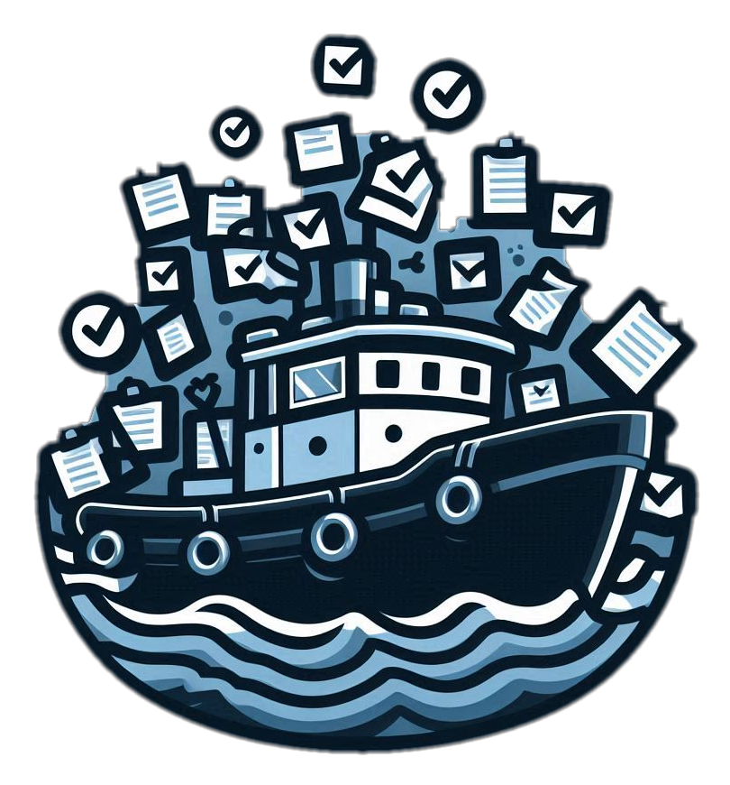
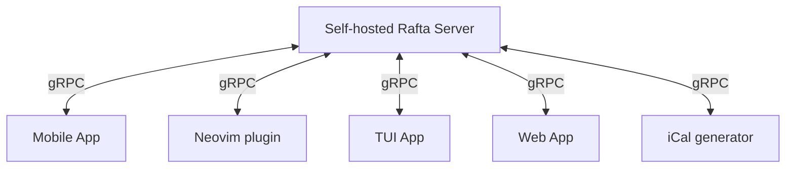

  

# Rafta

**R**eally, **A**nother **F***cking **T**odo **A**pp?!

## Why another TODO app?

Many open source implementations for ToDo apps go with a file-based approach
(ex: task-warrior, todo-txt, orgmode, markdown). While this simplicity is
elegant, it usually results in implementations that is lacking in the
following scenarios:

- Timely cross-device syncing
- Notifications (for reminders and due tasks)
- Good mobile interfaces

This is one of the reason many people prefer a server based approach (ex:
Todoist, Apple reminders, Evernote, TickTick). However, these tend to be much
more complex and gravitate towards a proprietary, for-profit solution. This
makes them generally harder to hack around when it comes to creating custom
clients

This project aims to get the best of both worlds: Cross platform reliability of
a server-based approach with the hackability of scrappy text-based management.

## Goals

This project stems from my frustration trying to find a decent Task management
infrastructure that fits my needs. So the project's primary goals are to
fulfill the following needs:

- Easy synchronisation between multiple clients (mobile desktop and such)
- Neovim plugin as a desktop client (with a similar feel to [oil.nvim][1])
- Pretty mobile interface (most txt-based apps are quite ugly IMO)
- Notifications that are on-time on mobile
- Easy extensibility through third-party clients (both daemons & user-facing)

## Implementation

So what's the plan to achieve this? This repo contains the implementation
of a server as well as the communication specification to that server.
Everyone is welcome to create their own frontend for that server as well as
other tooling that can communicate with said server. Examples of that could be

- mobile/desktop app
- web app
- text-editor plugin
- conky/uebersicht desktop task viewer
- Web Endpoint for an iCal calendar
- webhook server

As this project is in its infancy, specifications are subject to change but
this is bound to diminish over time. Communications are done over a gRPC
specification that can be found in the `resources/schema.proto` file.

The end result would be something similar to this:

Since the aim is for each user to self host his task (and at most the task of a
few friends), a single container approach with an SQLite storage solution will
be implemented.

The centerpiece is the server itself so but as it's development matures, I will
try and develop a client in Neovim as well as a mobile client.

## Roadmap

- [X] Blank Database Initialization
- [X] Logging framework (request-ID, stack traces, optional Json)
- [X] Protobuf schema definition
- [X] Request-ID tracking middleware
- [X] User Authentication (probably jwt)
- [ ] **Actual Server Logic**
- [ ] Neovim plugin client
- [ ] Task re-scheduling routine

[1]: https://github.com/stevearc/oil.nvim
