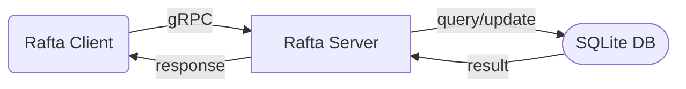

  

# Rafta

**R**eally, **A**nother **F***cking **T**odo **A**pp?!

## Why?

Most TODO tools suck for power users:

- **In your way**: You have to *go to them*. They don't notify you, or embed into your workflow.
- **Overkill**: Many try to be wikis, calendars, or even programming platforms.
- **Walled gardens**: APIs locked behind subscriptions or bad docs.
- **Hard to extend**: Monolithic or closed-source.
- **Stuck in files**: Forcing you to setup/use cloud storage like Dropbox, iCloud,
  SyncThing just to keep your tasks in sync accross devices.

Rafta flips that:

- A **simple gRPC server** to store and sync tasks.
- A **clean schema** designed for anyone to build clients.
- **No scope creep** — task management, nothing more.
- **Built for hackers** — SQLite backend, no lock-in.
- Self-hosted **Server Approach** - Ensuring a common source of truth for all
  your devices

If you want a TODO system that *stays out of your way* and works wherever *you*
work (Neovim, shell, mobile, etc.), take part in the development of rafta.
I promise, I put a lot of thought into it before risking
[creating a new standard][8].

## Dev Setup

- API: gRPC, documented in `resources/schema.proto`
- Auth: [JWT][11] (via Auth endpoint)
- Quickstart: `docker-compose up`
- Client responsibility: All UI, notifications, etc.

## Client ideas

- **Neovim Plugin**: Like [oil.nvim][10], but for tasks.
- **Mobile App**: Clean UI, simple UX, timely push notifications.
- **[iCal][9] Client**: Generate public/private calendar feeds from task filters.

## Why not existing tools?

- **[Orgmode][1]** / **[TodoTxt][2]** / **[Vimwiki][6]**: Fragile text parsing, sync requires **all** clients to support the specific cloud hosting *you* chose.
- **[Obsidian][3]**: Closed source, poor plugin interop.
- **[Todoist][4]**: Great UX, but API is paywalled.
- **[Apple Reminders][5]**: Locked to macOS/iOS.

Rafta is a **thin server spec** with an open schema. You bring the clients.

[1]: https://orgmode.org
[2]: https://todotxt.org
[3]: https://obsidian.md
[4]: https://www.todoist.com
[5]: https://apps.apple.com/ca/app/reminders/id1108187841
[6]: https://vimwiki.github.io
[7]: https://github.com/romgrk/todoist.nvim
[8]: https://xkcd.com/927
[9]: https://en.wikipedia.org/wiki/ICalendar
[10]: https://github.com/stevearc/oil.nvim
[11]: https://jwt.io/introduction
