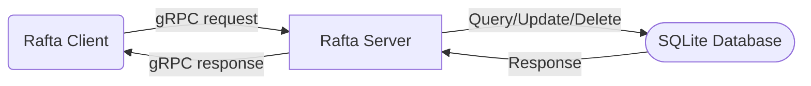

  

# Rafta

**R**eally, **A**nother **F***cking **T**odo **A**pp?!

## Why another TODO app?

I mainly want these things in a task management solution:

- Accessible where I already am (come to me not the other way around)
    - notify rather than require me to open an app
    - neovim plugin
    - good mobile app
- Timing that just works
    - Mature recurrence
    - Timely notifications
- No scope creeping
    - Don't try to be a wiki, execute code snippets
- Extensible (easy to hack on)
    - Easy to understand/implement API to extend the app rather than it being
    a monolith

I felt like with every solution I tried, there were many
tradeoffs. So I decided to make my own thing with the following
principles/structure:

- Create a central server which holds all tasks and syncs them to devices
- Create a simple communication layer (grpc) so anyone can build it's own
  client to fetch/update/delete tasks (the whole thing is open-source)
- Write clients for myself so I can have task management apps which are
  accessible to me

## Usage & Contributing

Although the server Implementation is mostly done, I haven't created a client
that uses this server to manage tasks yet (I'm in the very early stages of a
Neovim plugin). If you would like to implement a client for your usecase, feel
more than welcome to do so. Although robust scheduling is planned as a feature,
it is not yet implemented as I want to created my own scheduling engine taking
inspiration from both cron and Todoist (as weird as this may sound) and release
it as a standalone library/standard that can be used in more than just this
app.

Note that authentication is done using [JWT][11] and tokens can be requested
via the gRPC Auth endpoint (which implies you should use https at all times
with this service).The entire gRPC spec to develop a client is inside
`resources/schema.proto` and is fairly well documented. A docker-compose file
also provided to help with quickly setting up a development server.

## Client ideas

Clients are anything that connect to the tasks server. In most cases, this is
something a user interacts with directly (like an app or a plugin). But
sometimes, a client is something that can run in the background.

Here are some clients I am thinking about building:

**Calendar Server**: A client that runs with admin privileges and generates and
hosts [iCal][9] links for users that require them via an api (or a frontend).
It could be possible to revoke/re-generate an iCal url if it gets leaked.
Another neat feature would be to generate calendars based on tag filters, maybe
even embedding them in the links as some sort of rest API (ex: `https://rafta.net/user-token?minpriority=3&labels=math,exam`).

**Neovim Plugin**: I do all my work in neovim and my fingers are used to the
shortcuts it provides. I'm thinking of building a plugin that works very
similarly to how [oil.nvim][10] works. Except, you would edit task instead
of filenames, and opening a task would instead open it's description as a
markdown file in a new buffer.

**Mobile App**: I have never written a mobile app before so this will be a
first. But I'll try to keep it simple and focus on three things: a UI that
isn't ugly, an interface that's easy to use (doesn't feel clunky), and
notifications that happen on-time.

## Other solutions

[Re-creating something that already exists from scratch is often stupid][8].
I needed a real-good reason to do it. Here's everything I tried (at least I
think) and why none of them quite fit my usecase. Hopefully you'll agree with
me that a new standard isn't so outlandish. And perhaps, you'll even want to
build upon what I did and write you own rafta client :wink:

[Orgmode][1]:
Developped for emacs, this is a text-based note taking with extensive task
management capabilities. Like any text-based solution. Implementations require
parsing text and keeping files in sync between multiple devices. If files don't
sync, reminders don't work and tasks aren't where you might need them.

[TodoTxt][2]:
Meant as a minimal and focused solution, this solutions has the same
shortcomings as any text-based solution. Keeping the focus narrow is definitely
a win though as it makes parsing/searching for tasks simpler. The app is clunky
at best and requires setting up a file server such as syncthing or dropbox.

[Obsidian][3]:
Obsidian is meant as a personal wiki and relies on plugins for good task
management making it less extensible (A plugin of a plugin is much more niche
than just a plugin ecosystem). Also, the solution is closed source which makes
user dependent on obsidian staying alive.

[Todoist][4]:
With an amazing mobile app, and excellent natural-language processing of
reminders and recurrence, Todoist was my main app for a while. However, API
access is locked behind a subscription making the use of plugins such as
[Todoist.nvim][7] a paid endeavour.

[Apple Reminders][5]:
Siri integration makes creating tasks super accessible. However, it's locked
into the Apple ecosystem making it unusable on linux system (without relying on
hacks which don't feel worthwhile).

[Vimwiki][6]:
Another case of an app that is mainly a documentation app with task management
tacked onto it. It has the same disadvantages as other text-based solution. The
standard being more niche than orgmode makes plugins/app for the standard rare
also.

[1]: https://orgmode.org
[2]: https://todotxt.org
[3]: https://obsidian.md
[4]: https://www.todoist.com
[5]: https://apps.apple.com/ca/app/reminders/id1108187841
[6]: https://vimwiki.github.io
[7]: https://github.com/romgrk/todoist.nvim
[8]: https://xkcd.com/927
[9]: https://en.wikipedia.org/wiki/ICalendar
[10]: https://github.com/stevearc/oil.nvim
[11]: https://jwt.io/introduction
